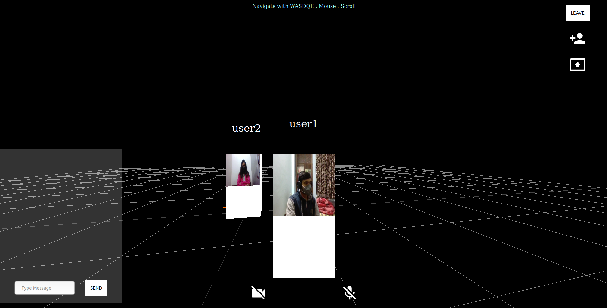
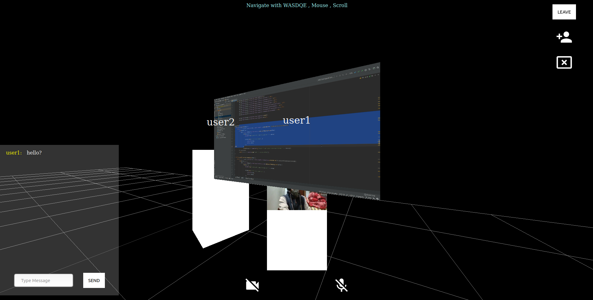
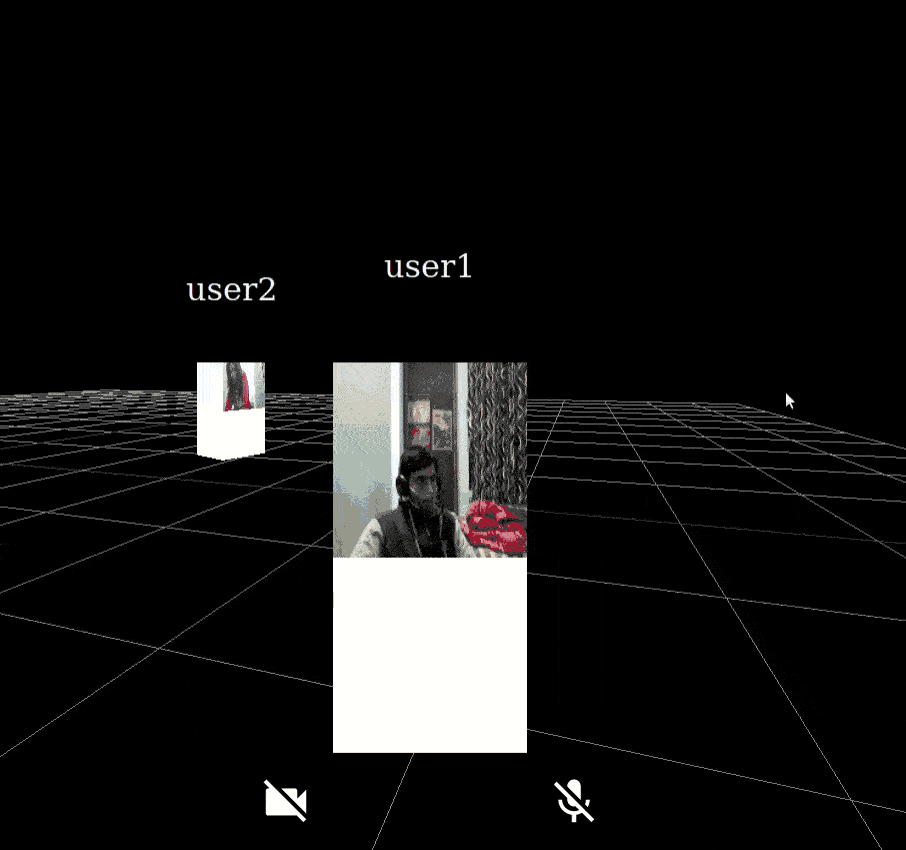

# ReelWorld

About:
* A web based video conferencing app within a virtual world, brings
online meeting experience as close to physical meetings as possible.
* Uses positional audio and movement controls within the world to give
real life audio experience.
* Share screen as boards, use room names to join or create meetings and
send public messages.
* Uses WebRTC and signalling servers to create communication between
clients.

Commands to run:
* ```npm install```
* ```npm start```

Note: Go to 'dev' branch for the main progress.

Recordings:






